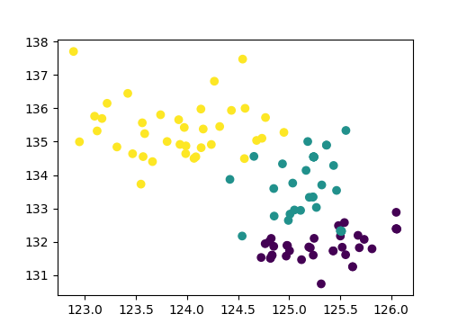
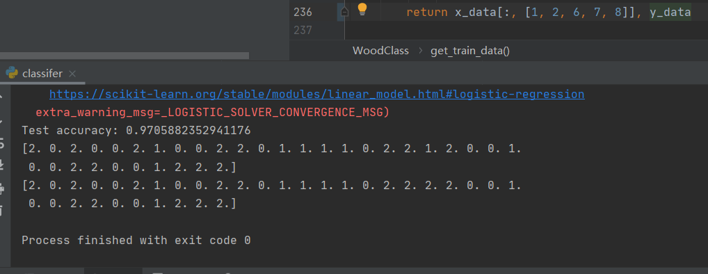

# 木地板分色识别项目

## 训练数据准备

请在使用前在同一文件夹下创建data文件夹，所需的文件目录如下：

```bash
.
├── README.md
├── classifer.py
├── data
│   ├── dark
│   ├── light
│   └── middle
```

上上面所示的三个文件夹下分别放置三种不同色彩的木板图片就可以训练了。

当然不要放除了图片外的东西，不然程序会出错哦。

## 色彩提取

下图为色彩提取效果：


我们利用概率的方法以随机对抗随机，然后使用二项分布的概率分位点即可获得任意纯度下的木板色彩。

但是纯度过高有时反而会难以反映木板的颜色，所以关于纯度的取舍还需调整。目前的纯度要求0.99999下，该木板的分类效果好像可以有较好的表现，反正之后再调整嘛~

## 色彩分布

我们可以明显发现，在进行了色彩提纯后，色彩的区分度在lab空间下的ab平面还是很具备可分性的，所以直接用logistic regression这样的线性方法就够了。



在classifer中还有6处简单的TODO, 交给老孙完成了，加油！


最终通过选择多次特征的组合，找到了效果比较好的特征 1 2 6 7 8 或 1 2 6 7 

在数据集上的测试准确率为： 97.05%



## 开机自启动

启动文件 xxx.bat 放在路径
```bash
C:\Users\你的用户名\AppData\Roaming\Microsoft\Windows\Start Menu\Programs\Startup
```
示例如下
```bash
@echo off
if "%1" == "h" goto begin
mshta vbscript:createobject("wscript.shell").run("""%~0"" h",0)(window.close)&&exit
:begin

call C:\Users\FEIJINTI\miniconda3\Scripts\activate.bat C:\Users\FEIJINTI\miniconda3
call conda activate cv
cd C:\Users\FEIJINTI\OneDrive - macrosolid\PycharmProjects\start_test
python 1.py
pause
```
其中第一段是为了不显示cmd窗口

第二段根据需求修改环境名以及启动程序

## 代码加密

安装
```bash
pip install jmpy3

```

```bash
# -*- coding: utf-8 -*-
"""
py文件加密为so或pyd
python代码 加密|加固
参数说明：
    -i | --input_file_path    待加密文件或文件夹路径，可是相对路径或绝对路径
    -o | --output_file_path   加密后的文件输出路径，默认在input_file_path下创建dist文件夹，存放加密后的文件
    -I | --ignore_files       不需要加密的文件或文件夹，逗号分隔
    -m | --except_main_file   不加密包含__main__的文件(主文件加密后无法启动), 值为0、1。 默认为1

报错：
    AttributeError: 'str' object has no attribute 'decode'
    找到报错文件：_msvccompiler.py
    参考：https://blog.csdn.net/qq_43192819/article/details/108981008
    128行代码修改为：.encode().decode('utf-16le', errors='replace')
"""

from jmpy.encrypt_py import start_encrypt
# 需要加密的py文件
input_file_path = "test.py"
# 直接运行
start_encrypt(input_file_path=input_file_path, output_file_path=None, ignore_files=None, except_main_file=0)

```

## 现场运行环境

下载在requirements.txt

```bash
name: wood
channels:
  - defaults
dependencies:
  - blas=1.0=mkl
  - bottleneck=1.3.5=py310h9128911_0
  - brotli=1.0.9=h2bbff1b_7
  - brotli-bin=1.0.9=h2bbff1b_7
  - bzip2=1.0.8=he774522_0
  - ca-certificates=2022.07.19=haa95532_0
  - certifi=2022.6.15=py310haa95532_0
  - cycler=0.11.0=pyhd3eb1b0_0
  - fftw=3.3.9=h2bbff1b_1
  - fonttools=4.25.0=pyhd3eb1b0_0
  - freetype=2.10.4=hd328e21_0
  - glib=2.69.1=h5dc1a3c_1
  - gst-plugins-base=1.18.5=h9e645db_0
  - gstreamer=1.18.5=hd78058f_0
  - icc_rt=2019.0.0=h0cc432a_1
  - icu=58.2=ha925a31_3
  - intel-openmp=2021.4.0=haa95532_3556
  - joblib=1.1.0=pyhd3eb1b0_0
  - jpeg=9e=h2bbff1b_0
  - kiwisolver=1.4.2=py310hd77b12b_0
  - lerc=3.0=hd77b12b_0
  - libbrotlicommon=1.0.9=h2bbff1b_7
  - libbrotlidec=1.0.9=h2bbff1b_7
  - libbrotlienc=1.0.9=h2bbff1b_7
  - libclang=12.0.0=default_h627e005_2
  - libdeflate=1.8=h2bbff1b_5
  - libffi=3.4.2=hd77b12b_4
  - libiconv=1.16=h2bbff1b_2
  - libogg=1.3.5=h2bbff1b_1
  - libpng=1.6.37=h2a8f88b_0
  - libtiff=4.4.0=h8a3f274_0
  - libvorbis=1.3.7=he774522_0
  - libwebp=1.2.2=h2bbff1b_0
  - libxml2=2.9.14=h0ad7f3c_0
  - libxslt=1.1.35=h2bbff1b_0
  - lz4-c=1.9.3=h2bbff1b_1
  - matplotlib=3.5.2=py310haa95532_0
  - matplotlib-base=3.5.2=py310hd77b12b_0
  - mkl=2021.4.0=haa95532_640
  - mkl-service=2.4.0=py310h2bbff1b_0
  - mkl_fft=1.3.1=py310ha0764ea_0
  - mkl_random=1.2.2=py310h4ed8f06_0
  - munkres=1.1.4=py_0
  - numexpr=2.8.3=py310hb57aa6b_0
  - numpy=1.21.5=py310h6d2d95c_3
  - numpy-base=1.21.5=py310h206c741_3
  - openssl=1.1.1q=h2bbff1b_0
  - packaging=21.3=pyhd3eb1b0_0
  - pandas=1.4.3=py310hd77b12b_0
  - pcre=8.45=hd77b12b_0
  - pillow=9.2.0=py310hdc2b20a_1
  - pip=22.1.2=py310haa95532_0
  - ply=3.11=py310haa95532_0
  - pyparsing=3.0.9=py310haa95532_0
  - pyqt=5.15.7=py310hd77b12b_0
  - pyqt5-sip=12.11.0=py310hd77b12b_0
  - python=3.10.4=hbb2ffb3_0
  - python-dateutil=2.8.2=pyhd3eb1b0_0
  - pytz=2022.1=py310haa95532_0
  - qt-main=5.15.2=he8e5bd7_7
  - qt-webengine=5.15.9=hb9a9bb5_4
  - qtwebkit=5.212=h3ad3cdb_4
  - scikit-learn=1.1.1=py310hd77b12b_0
  - scipy=1.7.3=py310h6d2d95c_2
  - setuptools=63.4.1=py310haa95532_0
  - sip=6.6.2=py310hd77b12b_0
  - six=1.16.0=pyhd3eb1b0_1
  - sqlite=3.39.2=h2bbff1b_0
  - threadpoolctl=2.2.0=pyh0d69192_0
  - tk=8.6.12=h2bbff1b_0
  - toml=0.10.2=pyhd3eb1b0_0
  - tornado=6.1=py310h2bbff1b_0
  - tzdata=2022a=hda174b7_0
  - vc=14.2=h21ff451_1
  - vs2015_runtime=14.27.29016=h5e58377_2
  - wheel=0.37.1=pyhd3eb1b0_0
  - wincertstore=0.2=py310haa95532_2
  - xz=5.2.5=h8cc25b3_1
  - zlib=1.2.12=h8cc25b3_2
  - zstd=1.5.2=h19a0ad4_0
  - pip:
    - cython==0.29.20
    - greenlet==1.1.3
    - jmpy3==1.0.6
    - mysql==0.0.3
    - mysqlclient==2.1.1
    - opencv-python==4.6.0.66
    - sqlalchemy==1.4.41
prefix: C:\Users\USER\.conda\envs\wood
